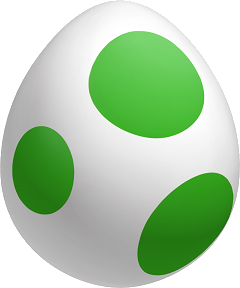
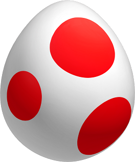

# This is my Snake 2D Game. 
Snake 2D Game has two GamePlay modes. 
 1. Single Player (One Snake)
 2. Two Players (Two Snakes)

## Snake functionally: 

#### Movement:
 1. Core functionality of a snake where snake should move in all 4 directions ⬆️ ⬇️ ⬅️➡️
 2. Screen wrapping for all the directions ⬆️ ⬇️ ⬅️➡️
    
#### Food:
This game has two types of food for Snakes. Foods will randomly spawn random locations on the SnakeGrid and random intervals. 
 1. GreenFood: This will increase the length of the Snake player.
 2. RedFood: This will reduce the length of the Snake player.

## Power Ups: 
This game has three types of Power-Ups for Snakes. Power-Ups will randomly spawn random locations on the SnakeGrid and random intervals. 
Only one Power-up will be active at a time. Collecting another power-up while having a power-up will give an error message.

#### Shield: 
- Will activate by collecting Shield items.
- It will shield Snake from bites, while it is active.
- Will automatically be disabled after its lifetime.
#### SpeedBoost:
- Will activate by collecting SpeedBoost items.
- It will increase Snake's movement speed, while it is active.
- Will automatically be disabled after its lifetime.
#### ScoreBoost:
- Will activate by collecting ScoreBoost items.
- It will double the score gained by Snake during its active period.
- Will automatically be disabled after its lifetime.

## Health System: 
 #### 1. Single Player Mode:
 - Snake Player will have 3 lives.
 - It will lose one life when it's biting itself.
 - It will respawn in the game and its score will reset.
 - After losing all three lives, the game will be over.
 - Its max score among three lives will be displayed as Winner Max Score on Game Over Screen.
 - If the max score reaches the set Target Score, the Game Win will appear with Winner's Max Score.
 #### 2. Two-Player Mode:
 - Each Snake Player will have 3 lives.
 - It will lose one life when it gets bitten by the other Snake and bites itself.
 - The Snake that gets bitten score will reset to zero, and Snake which bites score remains the same.
 - The Snake that gets bitten will remain the same length and Snake which bites will reset its length.
 - The snake that bites should get benefited from its length as the score remains the same.
 - The snake which lost all 3 lives will lose and the other that bites thrice will win. 

#### Score: 
 1. GreenFood will increase the Snake player's score.
 2. RedFood will decrease the Snake player's score.

#### Death and Win Condition: 
 It's simple for both GamePlay modes the Snake that losses all 3 lives will die.
  1. Single Player Mode: If any Max Score reaches Set Target among 3 lives. It will win or it's Game Over.
  2. Two-Player Mode: The snake that remains with lives will win. 

## Menu and UI options: 

#### Lobby: 
 - Play: This will lead to GamePlay mode selection.
 - 1 Player: Will load to Single Play (one snake) GamePlay mode.
 - 2 Players: Will load to Two Players (two snakes) GamePlay mode.
 - Back: will get back to the Lobby page again.
 - Music Icon: Will enable and disable Background music.
 - Speaker Icons: Will enable and disable Game Sounds. 

#### 1 Player GamePlay: 
- Will have Score, Lives, Floating Text elements, and Pause buttons. Movement by: ⬆️ ⬇️ ⬅️➡️
- Pause: will affect gameplay to pause and the player will get options to Resume and Exit.
- Resume: will resume the gameplay from where it is Paused.
- Exit: will load the Lobby page.
- On GameOver: Player will get Reply and Exit options.
- Reply: Replay the same mode.
- Exit: will load the Lobby page.
- On YouWin: Player will get Replyagain and Exit options.
- Replyagain: Replay the same mode.
- Exit: will load the Lobby page.
   
#### 2 Players GamePlay: 
- Will have Score, Lives, Floating Text elements, and Pause buttons.
- Player1: Movement by: ⬆️ ⬇️ ⬅️➡️
- Player2: Movement by: W A S D
- Pause: will affect gameplay to pause and the player will get options to Resume and Exit.
- Resume: will resume the gameplay from where it is Paused.
- Exit: will load the Lobby page.
- On YouWin: Player will get Replyagain and Exit options. One Player should win all the time.
- Replyagain: Replay the same mode.
- Exit: will load the Lobby page.

   

### Green Food
  
  

 ### Red Food 
         

### Shield Power   
         

### SpeedUp Power   

 

### ScoreBoost Power   

### Snake One    

### Snake Two    

